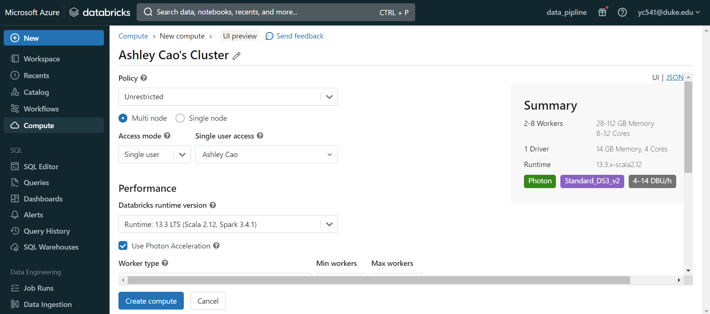
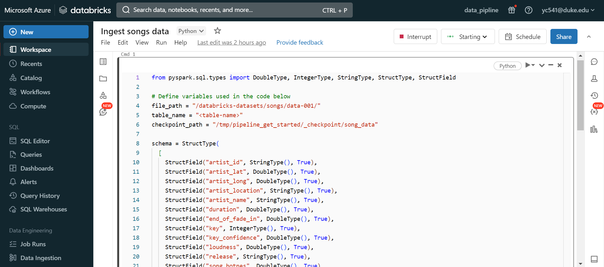
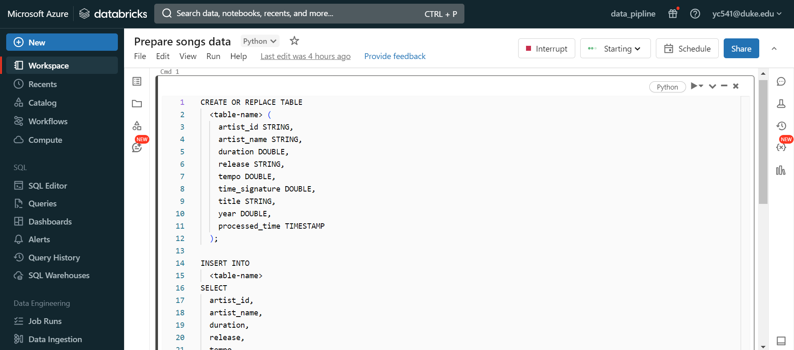
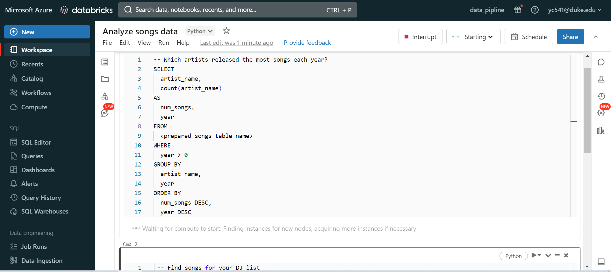
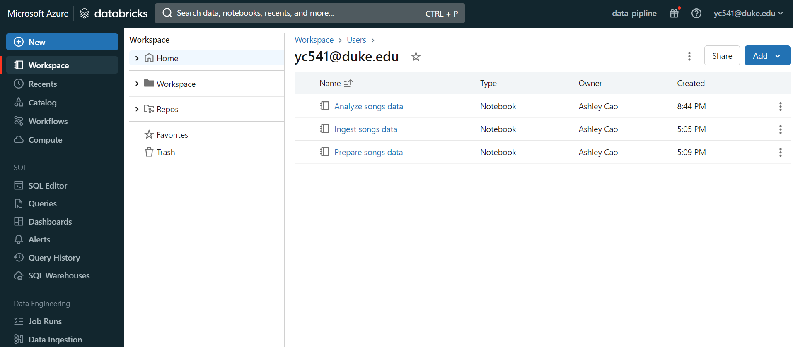
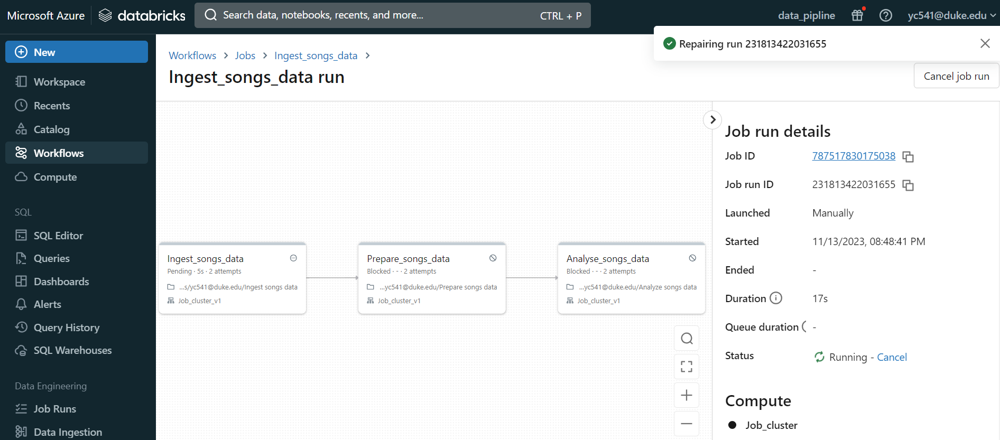

# Data Pipeline with Databricks

## Overview
This README provides my operations and instructions on setting up a data pipeline in Databricks. The small project reads data from a CSV file, performs simple transformations, and writes the result to a Parquet file.

 reference: https://docs.databricks.com/en/getting-started/data-pipeline-get-started.html

The dataset used in this example is a subset of the Million Song Dataset( http://millionsongdataset.com/pages/getting-dataset/#subset)

# Data Pipeline Project

## Steps

1. **Create Cluster**: Set up a Databricks cluster to process the data.
    

2. **Ingest Data**: Load the subset of the Million Song Dataset into Databricks.
    

3. **Prepare Data**: Perform data cleaning and preparation.
    

4. **Analyse Data**: Conduct data analysis to derive insights.
    

5. **Workspace Overview**: View all notebooks used in this project.
    

6. **Workflow**: Overview of the complete data pipeline.
    

## Dataset Reference

- The dataset used is a subset of the [Million Song Dataset](http://millionsongdataset.com/pages/getting-dataset/#subset).

## Documentation Reference

- The steps followed in this project are based on the [Databricks documentation](https://docs.databricks.com/en/getting-started/data-pipeline-get-started.html).

